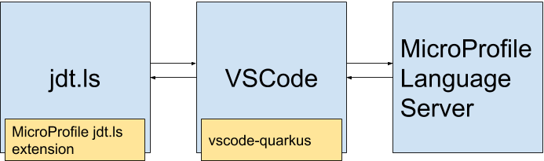
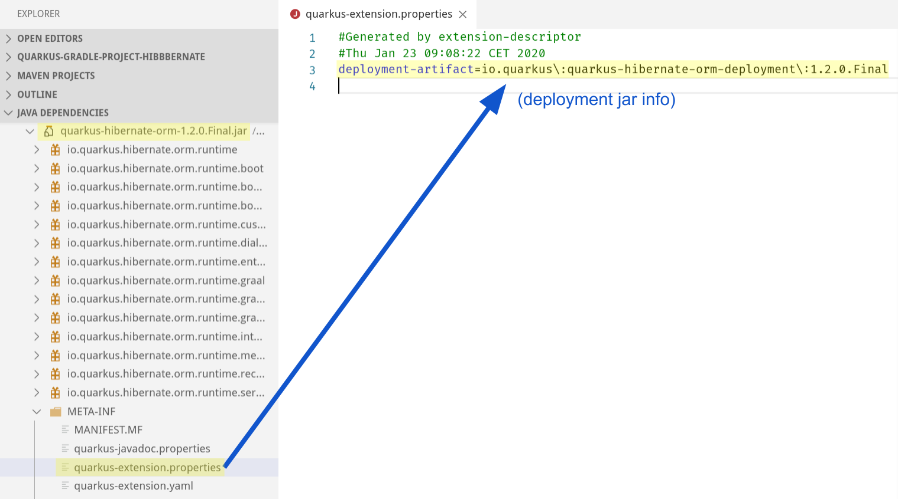
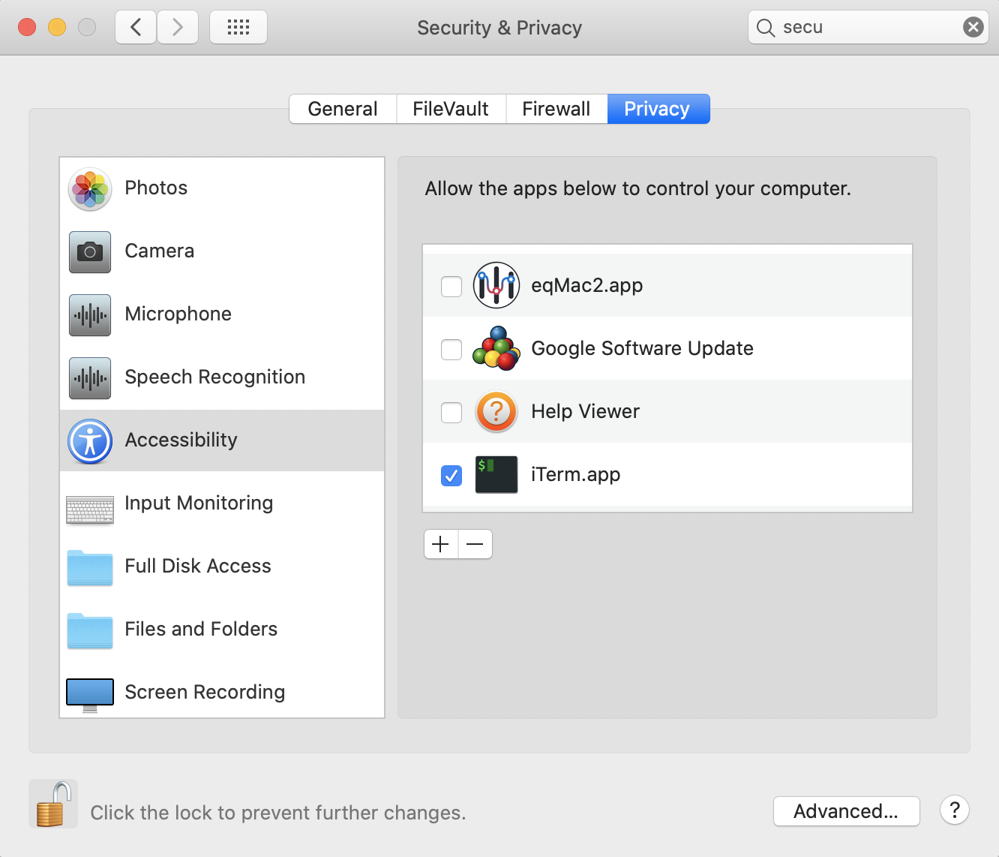
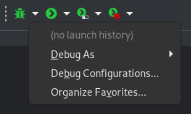
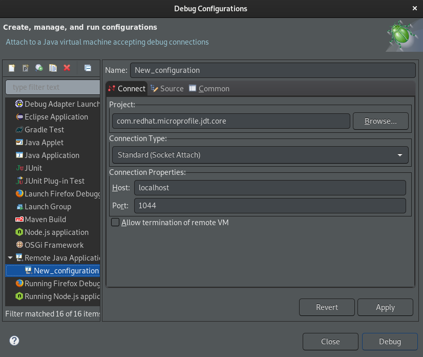

# Contribution Guide

Contributions are extremely welcome, no matter how big or small.
If you have any questions or suggestions we are happy to hear them.

# Table of Contents
1. [Project Structure](#project-structure)
2. [Implementing language features for `application.properties`](#implementing-language-features-for-applicationproperties)
    1. [Searching for properties in JARs not in the user's Quarkus project's classpath](#searching-for-properties-in-jars-not-in-the-users-quarkus-projects-classpath)
3. [Implementing language features for Java files](#implementing-language-features-for-java-files)
4. [Development Setup](#development-setup)
    1. [Installation Prerequisites](#installation-prerequisites)
    2. [Setup](#setup)
    3. [Running vscode-quarkus](#running-vscode-quarkus)
    4. [Testing vscode-quarkus](#testing-vscode-quarkus)
5. [Debugging](#debugging)
    1. [Debugging the MicroProfile language server](#debugging-the-microprofile-language-server)
    [Debugging the MicroProfile jdt.ls extension](#debugging-the-microprofile-jdtls-extension)

## Project Structure
vscode-quarkus extends [vscode-microprofile](https://github.com/redhat-developer/vscode-microprofile) to benefit with 
MicroProfile/Quarkus `properties` and `Java` files support.

See [Contributing guide](https://github.com/redhat-developer/vscode-microprofile/blob/master/CONTRIBUTING.md#project-structure) for more information.

For vscode-quarkus to work, it relies on the
[MicroProfile language server](https://github.com/eclipse/lsp4mp/tree/master/microprofile.ls)
and the 
[MicroProfile jdt.ls extension](https://github.com/eclipse/lsp4mp/tree/master/microprofile.jdt)
. The MicroProfile language server is responsible for providing
[LSP language features](https://microsoft.github.io/language-server-protocol/specification)
to VSCode, while the MicroProfile jdt.ls extension is responsible
for functionalities like listening
to Java classpath changes and generating config setting metadata for
the `application.properties` file.
The reason why 
[vscode-java](https://github.com/redhat-developer/vscode-jav) 
is required for vscode-quarkus to work, is because vscode-java
starts the [jdt.ls](https://github.com/eclipse/eclipse.jdt.ls)
language server, which is required to run the MicroProfile jdt.ls extension.

**Note**: The MicroProfile language server currently provides language features for both `*.properties` and `*.java` files.
Please see [quarkus-ls#215](https://github.com/redhat-developer/quarkus-ls/issues/215).

  
The image above represents communication between the three components. 
As the image implies, the MicroProfile language server cannot directly 
communicate with the MicroProfile jdt.ls extension and vice-versa. They must 
communicate via vscode-quarkus.  

Here is an example of how the components work together for
`application.properties` completion:

**Step 1.** A Quarkus project is opened in VSCode, and completion has been 
invoked inside the `application.properties` file, which sends a
`textDocument/completion` request to the MicroProfile language server.  

**Step 2.** MicroProfile language server checks its cache if completion options
exist.  
* If it exists the MicroProfile language server sends them to VSCode 
as the response to the `textDocument/completion` request.
Communication is complete, and does not proceed to Step 3 
and onwards.
* If it does not exist, the MicroProfile language server sends a 
custom request, `microprofile/projectInfo` to vscode-quarkus.  
Proceed to Step 3.  

**Step 3.** vscode-quarkus receives the `microprofile/projectInfo` request,
and delegates it to the MicroProfile jdt.ls extension.  

**Step 4.** The MicroProfile jdt.ls extension receives the command, determines
[project information](https://github.com/eclipse/lsp4mp/tree/master/microprofile.jdt/org.eclipse.lsp4mp.jdt.core/src/main/java/org/eclipse/lsp4mp/commons/MicroProfileProjectInfo.java)
(project URI, configuration properties, hints etc.)
about the currently opened (MicroProfile or Quarkus) project and returns
the information to vscode-quarkus. The project information is then sent to
the MicroProfile language server

**Step 5.** vscode-quarkus receives the project information and sends it
to the MicroProfile language server.  

**Step 6.** MicroProfile language server receives the information, adds it 
to its cache, and returns the completion options stored in the 
project information as the response to the `textDocument/completion`
request.

## Implementing language features for `application.properties`
When an `application.properties` file sends a request (e.g. textDocument/completion) to the
MicroProfile language server, the requests are accepted in
[ApplicationPropertiesTextDocumentService#completion](https://github.com/eclipse/lsp4mp/tree/master/microprofile.ls/org.eclipse.lsp4mp.ls/src/main/java/org/eclipse/lsp4mp/ls/ApplicationPropertiesTextDocumentService.java#L150).
This class receives LSP requests for `application.properties` files.

Properties collected by the MicroProfile jdt.ls extension are cached to keep response times
fast.
Collecting properties will not be done unless absolutely necessary
(ie, if cache doesn't exist, if project dependencies change).

When the completion is triggered,
the MicroProfile LS checks the properties cache for the given `application.properties` file.
If the cache does not exist, it calls the `microprofile/projectInfo` request to call the JDT LS Extension [projectInfo delegate command handler](https://github.com/eclipse/lsp4mp/tree/master/microprofile.jdt/org.eclipse.lsp4mp.jdt.core/src/main/java/org/eclipse/lsp4mp/jdt/internal/core/ls/MicroProfileDelegateCommandHandler.java#L71) which
uses the
[properties manager](https://github.com/eclipse/lsp4mp/tree/master/microprofile.jdt/org.eclipse.lsp4mp.jdt.core/src/main/java/org/eclipse/lsp4mp/jdt/core/PropertiesManager.java)
that collects MicroProfile and Quarkus properties for the given Java project.

This manager is extensible by the
`org.eclipse.lsp4mp.jdt.core.propertiesProviders`
[extension point](https://github.com/eclipse/lsp4mp/blobl/master/microprofile.jdt/org.eclipse.lsp4mp.jdt.core/plugin.xml#L5):

 * [org.eclipse.lsp4mp.jdt.core](https://github.com/eclipse/lsp4mp/tree/master/microprofile.jdt/org.eclipse.lsp4mp.jdt.core/plugin.xml#L49-L52) defines properties provider for MicroProfile.
* [com.redhat.microprofile.jdt.quarkus](https://github.com/redhat-developer/quarkus-ls/tree/master/quarkus.jdt.ext/com.redhat.microprofile.jdt.quarkus/plugin.xml#L5-L10) defines properties provider for Quarkus.

Here are some providers and the annotation(s) they scan for:

| Class | Annotations |
|-------|-------------|
| [MicroProfileConfigPropertyProvider](https://github.com/eclipse/lsp4mp//tree/master/microprofile.jdt/org.eclipse.lsp4mp.jdt.core/src/main/java/com/redhat/microprofile/jdt/internal/core/providers/MicroProfileConfigPropertyProvider.java) | org.eclipse.microprofile.config.inject.ConfigProperty |
| [MicroProfileRegisterRestClientProvider](https://github.com/eclipse/lsp4mp//tree/master/microprofile.jdt/org.eclipse.lsp4mp.jdt.core/src/main/java/com/redhat/microprofile/jdt/internal/core/providers/MicroProfileRegisterRestClientProvider.java) | org.eclipse.microprofile.rest.client.inject.RegisterRestClient |
| [QuarkusConfigPropertiesProvider](https://github.com/redhat-developer/quarkus-ls/tree/master/quarkus.jdt.ext/com.redhat.microprofile.jdt.quarkus/src/main/java/com/redhat/microprofile/jdt/internal/quarkus/providers/QuarkusConfigPropertiesProvider.java) | io.quarkus.arc.config.ConfigProperties |
| [QuarkusConfigRootProvider](https://github.com/redhat-developer/quarkus-ls/tree/master/quarkus.jdt.ext/com.redhat.microprofile.jdt.quarkus/src/main/java/com/redhat/microprofile/jdt/internal/quarkus/providers/QuarkusConfigRootProvider.java) | io.quarkus.runtime.annotations.ConfigRoot |
| [QuarkusKubernetesProvider](https://github.com/redhat-developer/quarkus-ls/tree/master/quarkus.jdt.ext/com.redhat.microprofile.jdt.quarkus/src/main/java/com/redhat/microprofile/jdt/internal/quarkus/providers/QuarkusKubernetesProvider.java) | io.dekorate.kubernetes.annotation.KubernetesApplication<br>io.dekorate.openshift.annotation.OpenshiftApplication<br>io.dekorate.s2i.annotation.S2iBuild<br>io.dekorate.docker.annotation.DockerBuild |


### Searching for properties in JARs not in the user's Quarkus project's classpath
Some Quarkus properties like `quarkus.hibernate-orm.dialect` are not defined in JARs belonging
to the current Quarkus project's classpath. Some Quarkus classpath JARs have deployment JARs.
Generally speaking, deployment JARs are not present in the project's classpath.

If classpath JARs have a deployment JAR, it will be defined in the 
`META-INF/quarkus-extension.properties` file of the classpath JAR.

For example, the `quarkus-hibernate-orm-1.2.0.Final.jar` has a deployment JAR with
an artifactId of `quarkus-hibernate-orm-deployment`:


The MicroProfile jdt.ls extension creates a "fake" Java project with the deployment
JARs in its classpath and performs a scan for properties for this fake project, in order
to retreive the desired properties.

To make things more concrete:

Consider a Quarkus project with a `pom.xml` with this dependency:

```xml
<dependency>
    <groupId>io.quarkus</groupId>
    <artifactId>quarkus-hibernate-orm</artifactId>
</dependency>
```

Properties like `quarkus.hibernate-orm.dialect` and `quarkus.hibernate-orm.sql-load-script` are
not defined (no classes annotated with `@ConfigRoot`) in the `quarkus-hibernate-orm*.jar` JAR.

Those properties are located in its deployment JAR: `quarkus-hibernate-orm-deployment*.jar`.

The deployment jar is listed in `META-INF/quarkus-extension.properties` from the `quarkus-hibernate-orm*.jar` as a property:
		 
```
deployment-artifact=io.quarkus\:quarkus-hibernate-orm-deployment\:1.2.0.Final
```

Note that in most cases, a Quarkus project would not have deployment JARs listed as dependencies in the project's
`pom.xml`, which is why the deployment JARs would not be in the project's classpath.

Therefore in order to scan for the properties in the deployment JAR, under the hood, the MicroProfile jdt.ls extension delegates the resolution (i.e. download) of those deployment jars to Maven, regardless of the user project's build system.

In conclusion, a project depending on:

```xml
<dependency>
    <groupId>io.quarkus</groupId>
    <artifactId>quarkus-hibernate-orm</artifactId>
</dependency>
```

will generate the hibernate properties coming from the deployment JAR, like:

 * `quarkus.hibernate-orm.dialect`
 * `quarkus.hibernate-orm.sql-load-script`

even if the deployment JAR itself, was not declared in the Quarkus project's `pom.xml` like so:

```xml
<dependency>
    <groupId>io.quarkus</groupId>
    <artifactId>quarkus-hibernate-orm-deployment</artifactId>
</dependency>
```

## Implementing language features for Java files
When a Java file sends a request (e.g. `textDocument/codeLens`) to the
MicroProfile language server, the requests are accepted in
[JavaTextDocumentService#completion](https://github.com/eclipse/lsp4mp/tree/master/microprofile.ls/src/main/java/com/redhat/microprofile/ls/JavaTextDocumentService.java#L84).
This class receives LSP requests for Java files.

The `textDocument/codeLens`, `textDocument/publishDiagnostics`, `textDocument/hover` requests are delegated to
[`MicroProfileDelegateCommandHandlerForJava`](https://github.com/eclipse/lsp4mp/tree/master/microprofile.jdt/org.eclipse.lsp4mp.jdt.core/src/main/java/com/redhat/microprofile/jdt/internal/core/ls/MicroProfileDelegateCommandHandlerForJava.java) which creates the `lsp4j.Hover`, 
`lsp4j.CodeLens` and `lsp4j.PublishDiagnosticsParams` instances for hover, codelens and diagnostics respectively.

Just like how `application.properties` properties are extensible via extension point, Java codeLens, diagnostics and
hover are also extensible via extension point.

These Java features are extensible by the
`org.eclipse.lsp4mp.jdt.core.javaFeatureParticipants`
[extension point](https://github.com/eclipse/lsp4mp/tree/master/microprofile.jdt/com.redhat.microprofile.jdt.core/plugin.xml#L8):

 * [org.eclipse.lsp4mp.jdt.core](https://github.com/eclipse/lsp4mp/tree/master/microprofile.jdt/org.eclipse.lsp4mp.jdt.core/plugin.xml#L54-L57) defines Java feature participants for MicroProfile.
 * [com.redhat.microprofile.jdt.quarkus](https://github.com/redhat-developer/quarkus-ls/blob/dddd2248474d18db1f72c048499adf32332da265/quarkus.jdt.ext/com.redhat.microprofile.jdt.quarkus/plugin.xml#L17-L20)  defines Java feature participants for Quarkus.

Here are some examples of the leveraging the extension point to provide Java codeLens, diagnostics and hover:
| Java Feature                            | Participant                                                                                                                                                                                                                                                                         |
|-----------------------------------------|-------------------------------------------------------------------------------------------------------------------------------------------------------------------------------------------------------------------------------------------------------------------------------------|
| MicroProfile Health diagnostics         | [MicroProfileHealthDiagnosticsParticipant ](https://github.com/eclipse/lsp4mp/tree/master/microprofile.jdt/org.eclipse.lsp4mp.jdt.core/src/main/java/org/eclipse/lsp4mp/jdt/internal/health/java/MicroProfileHealthDiagnosticsParticipant.java )             |
| MicroProfile Rest Client diagnostics    | [MicroProfileRestClientDiagnosticsParticipant ](https://github.com/eclipse/lsp4mp/tree/master/microprofile.jdt/org.eclipse.lsp4mp.jdt.core/src/main/java/org/eclipse/lsp4mp/jdt/internal/restclient/java/MicroProfileRestClientDiagnosticsParticipant.java ) |
| MicroProfile Rest Client codeLens       | [MicroProfileRestClientCodeLensParticipant](https://github.com/eclipse/lsp4mp/tree/master/microprofile.jdt/org.eclipse.lsp4mp.jdt.core/src/main/java/org/eclipse/lsp4mp/jdt/internal/restclient/java/MicroProfileRestClientCodeLensParticipant.java)         |
| JAX-RS codelens                         | [JaxRsCodeLensParticipant ](https://github.com/eclipse/lsp4mp/tree/master/microprofile.jdt/org.eclipse.lsp4mp.jdt.core/src/main/java/org/eclipse/lsp4mp/jdt/internal/jaxrs/java/JaxRsCodeLensParticipant.java )                                              |
| MicroProfile `@ConfigProperty` name hover | [MicroProfileConfigHoverParticipant ](https://github.com/eclipse/lsp4mp/tree/master/microprofile.jdt/org.eclipse.lsp4mp.jdt.core/src/main/java/org/eclipse/lsp4mp/jdt/internal/config/java/MicroProfileConfigHoverParticipant.java )                         |


## Development Setup

### Installation Prerequisites

  * [Visual Studio Code](https://code.visualstudio.com/)
  * [Node.js 14.x](https://nodejs.org/en/)
  * [JDK 8+](http://www.oracle.com/technetwork/java/javase/downloads/index.html)

### Setup
**Step 1.** Fork and clone this repository  

**Step 2.** Fork and clone this [repository](https://github.com/redhat-developer/quarkus-ls), which
contains the MicroProfile jdt.ls extension and MicroProfile language server

**Note:** Ensure that the cloned repositories are under the same parent directory:

```
YOUR_FOLDER/
         ├──── vscode-quarkus/
         ├──── quarkus-ls/
```  
**Step 3.** Navigate into `vscode-quarkus/`
```bash
$ cd vscode-quarkus/
```  
**Step 4.** Install npm dependencies
```bash
$ npm install
```  

**Step 5.** Build the MicroProfile language server and MicroProfile jdt.ls extension
```bash
$ npm run build
```
This script does two things.
1. Builds the MicroProfile language server and places the jar in 
`vscode-quarkus/server/`.
2. Builds the MicroProfile jdt.ls extension and places the jar in 
`vscode-quarkus/jars/`.  

In addition to `npm run build`, there are two more build scripts:  
`npm run build-server` only builds the Quarkus language server and places the jar in `vscode-quarkus/server/`.  
`npm run build-ext` only builds the Quarkus jdt.ls extension and places the jar in `vscode-quarkus/jars/`.

### Running vscode-quarkus
**Step 1.** Open `vscode-quarkus/` in VSCode.  

**Step 2.** Open the Debugging tab, select and run 
"Launch Extension (vscode-quarkus)" at the top left.


### Testing vscode-quarkus
There are two types of tests written for vscode-quarkus:
the [integration tests](https://code.visualstudio.com/api/working-with-extensions/testing-extension) and the UI tests.

Run integration tests: `npm test`

Run UI tests: `npm run test-ui`

Run both (integration tests first, UI tests second): `npm run test-all`

These tests are located located in the `vscodeTest/` and `vscodeUiTest/` directories
respectively:
```
vscode-quarkus/
         ├──── src/
                ├──── test/
                        ├──── vscodeTest/
                        ├──── vscodeUiTest/
```  

To debug the integration tests, open the VS Code Debugging tab and
select the "Extension Tests (vscode-quarkus)" at the top left:
  

To debug the UI tests, open the VS Code Debugging tab and select
the "VS Code UI Extension Tests (vscode-quarkus)" at the top left:
  

Its very important to not disturb your machine when running the UI tests, or
else the test functions will not run properly.

**Note for running UI tests of macOS:**
Due to an issue for an upstream UI testing library:
[nut-tree/nut.js#98 (issue)](https://github.com/nut-tree/nut.js/issues/98#issuecomment-571494625), UI tests on macOS work as long as
Node version 12.12 or lower is used.

Additionally, you may also need to allow your terminal application to control your
computer like so:


## Debugging
### Debugging the MicroProfile language server:
In an IDE of your choice, set the debugger configuration to connect
to localhost, port 1064.

If using VSCode, open `quarkus-ls/microprofile.ls/` in VSCode. The proper
debugger configurations are already defined in `.vscode/`.
There should be a "Debug (Attach) - Remote (microprofile.ls)" option
at the top left of the Debugging tab.
  

The JVM arguments used to start the MicroProfile language
server are specified
[here](https://github.com/redhat-developer/vscode-quarkus/blob/master/src/languageServer/javaServerStarter.ts#L25).

### Debugging the MicroProfile jdt.ls extension:
Only Eclipse can be used to debug the MicroProfile jdt.ls extension.  

**Step 1.** Open the jdt.ls source code in a new workspace in Eclipse by
following the setup
steps in the jdt.ls GitHub repository 
[here](https://github.com/eclipse/eclipse.jdt.ls#first-time-setup).  

**Step 2.** In the same workspace, import the projects from
`quarkus-ls/microprofile.jdt/`.

**Step 3.** In the Debug dropdown menu, open "Debug Configurations...".  
  

**Step 4.** Create a new "Remote Java Application" launch configuration.  
Set the following settings and click "Apply":  
```
Project: com.redhat.microprofile.jdt.core
Connection Type: Standard (Socket Attach)
Host: localhost
Port: 1044
```

