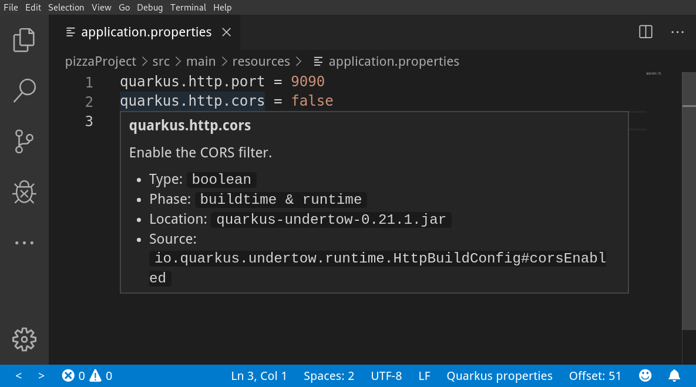

# Quarkus Tooling by Red Hat

## Description

This VS Code extension provides support for Quarkus development via a 
[Quarkus language server](https://github.com/redhat-developer/quarkus-ls/tree/master/quarkus.ls)
and a [Quarkus jdt.ls extension](https://github.com/redhat-developer/quarkus-ls/tree/master/quarkus.jdt).

## Quarkus Project Wizards
  * Generate a Quarkus Maven project with Maven wrapper files
  * Add Quarkus extensions to current Maven-based Quarkus project

## Quarkus `application.properties` Features
  * Completion support for Quarkus properties
  * Hover support for Quarkus properties

## Quarkus Code Snippets
This extension provides several code snippets, available when editing Java files:

  * **qrc** - Create a new Quarkus resource class
  * **qrm** - Create a new Quarkus resource method
  * **qtrc** - Create a new Quarkus test resource class
  * **qntrc** - Create a new Quarkus native test resource class

## Requirements

  * Java JDK (or JRE) 8 or more recent
  * [Language Support for Java(TM) by Red Hat](https://marketplace.visualstudio.com/items?itemName=redhat.java)

## Supported VS Code settings

The following settings are supported:
  
* `quarkus.tools.trace.server` : Trace the communication between VS Code and the Quarkus Language Server in the Output view.
* `quarkus.tools.symbols.showAsTree` : Show Quarkus properties as tree (Outline). Default is `true`.
* `quarkus.tools.validation.enabled` : Enables Quarkus validation. Default is `true`.
* `quarkus.tools.validation.unknown.severity` : Validation severity for unknown Quarkus properties. Default is `warning`.
* `quarkus.tools.validation.unknown.excluded` : Array of properties to ignore for unknown Quarkus properties validation. Default is `[]`.
        
## Contributing

This is an open source project open to anyone. Contributions are extremely welcome!

For information on getting started, refer to the [CONTRIBUTING instructions](CONTRIBUTING.md).

CI builds can be installed manually by following these instructions:

  1) Download the latest development VSIX archive [from here](https://download.jboss.org/jbosstools/vscode/snapshots/vscode-quarkus/?C=M;O=D). `(vscode-quarkus-XXX.vsix)`

  2) Go to the Extensions section in VS Code.

  3) At the top right click the `...` icon.

  4) Select 'Install from VSIX...' and choose the `.vsix` file.

## Feedback

File a bug in [GitHub Issues](https://github.com/redhat-developer/vscode-quarkus/issues).

## License

Apache License 2.0.
See [LICENSE](LICENSE) file.
