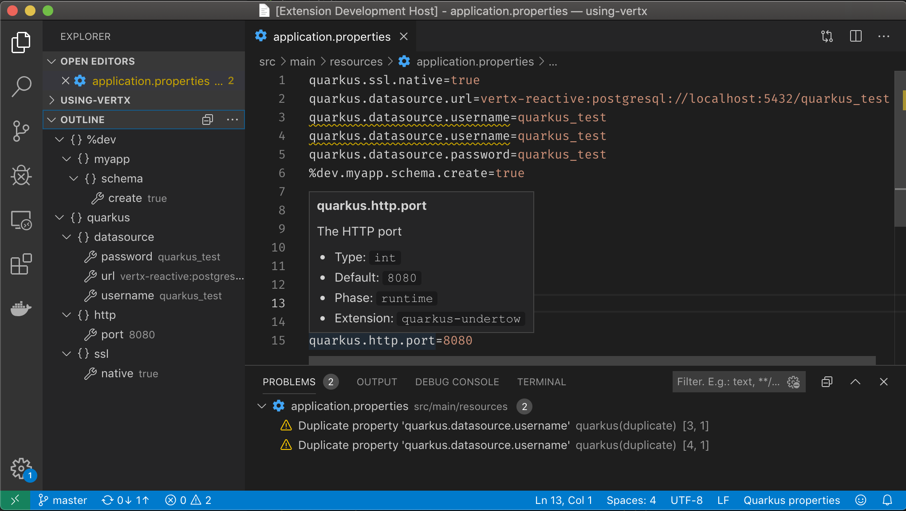

# Quarkus Tools for Visual Studio Code

## Description

This Visual Studio Code extension provides support for [Quarkus](https://quarkus.io/) and [MicroProfile](https://github.com/eclipse/microprofile) development
by extending [Visual Studio Code extension for MicroProfile](https://github.com/redhat-developer/vscode-microprofile) with Quarkus features.

## Quarkus VS Code Commands
The following commands are supported for both Maven and Gradle Quarkus projects:

  * `Quarkus: Generate a Quarkus project`: Generate a Quarkus project, based on https://code.quarkus.io/
  * `Quarkus: Add extensions to current project`: Add Quarkus extensions to currently opened Quarkus project
  * `Quarkus: Debug current Quarkus project`: Launches the Maven `quarkus:dev` plugin or the Gradle `quarkusDev` command and automatically attaches a debugger

## Quarkus/MicroProfile `properties` Features

In `application.properties` and `microprofile-config.properties` files, you will benefit with:

  * Completion support for Quarkus/MicroProfile properties
  * Hover support for Quarkus/MicroProfile properties
  * Definition support for Quarkus/MicroProfile properties
  * Format support for Quarkus/MicroProfile properties
  * Validation and Quick Fix support for Quarkus/MicroProfile properties
  * Support for Quarkus profiles
  * Outline support (flat or tree view)
  * Code snippets:
    * **qds** - Configure a Quarkus datasource
    * **qj** - Configure a Jaeger tracer

## Quarkus `yaml` Features

In `application.yaml` and `application.yml` files, you will benefit with:

  * Completion support for Quarkus/MicroProfile properties
  * Hover support for Quarkus/MicroProfile properties
  * Validation support for Quarkus/MicroProfile properties
  * Support for Quarkus profiles
  * Outline support

## Quarkus/MicroProfile `Java` Features

In `Java` files, you will benefit with:

  * Completion support for MicroProfile
  * Hover support for MicroProfile
  * Validation and Quick Fix support for MicroProfile
  * Code Lens support for Quarkus/MicroProfile
  * Code snippets:
    * **qrc** - Create a new Quarkus resource class
    * **qrm** - Create a new Quarkus resource method
    * **qtrc** - Create a new Quarkus test resource class
    * **qntrc** - Create a new Quarkus native test resource class
    * snippets for MicroProfile annotations.

## Requirements

  * [Visual Studio Code extension for MicroProfile](https://github.com/redhat-developer/vscode-microprofile)
  * Java JDK (or JRE) 11 or more recent
  * [Language Support for Java(TM) by Red Hat](https://marketplace.visualstudio.com/items?itemName=redhat.java)
  * [Debugger for Java](https://marketplace.visualstudio.com/items?itemName=vscjava.vscode-java-debug)

## Supported VS Code settings

The following settings are supported:

* All [microprofile.tools.* settings](https://github.com/redhat-developer/vscode-microprofile#supported-vs-code-settings) from the [Visual Studio Code extension for MicroProfile](https://github.com/redhat-developer/vscode-microprofile)
* `quarkus.tools.debug.terminateProcessOnExit` : Determines whether to terminate the quarkus:dev task after closing the debug session. Default is `Ask`.
* `quarkus.tools.alwaysShowWelcomePage` : Determines whether to show the welcome page on extension startup. Default is `true`.
* `quarkus.tools.starter.api` : Quarkus API base URL. Default is `http://code.quarkus.io/api`.
* `quarkus.tools.starter.showExtensionDescriptions`: Determines whether to show the Quarkus extension descriptions when selecting Quarkus extensions. Default is `true`.

Since 1.6.0:
* `quarkus.tools.propertiesLanguageMismatch` : Action performed when detected Quarkus properties have an incorrect language. Default is `forceQuarkus`.

## Telemetry

With your approval, vscode-quarkus extension collects anonymous [usage data](USAGE_DATA.md) and sends it to Red Hat servers to help improve our products and services.
Read our [privacy statement](https://developers.redhat.com/article/tool-data-collection) to learn more.
This extension respects the `redhat.telemetry.enabled` setting, which you can learn more about at https://github.com/redhat-developer/vscode-redhat-telemetry#how-to-disable-telemetry-reporting

## Articles

 * [Quarkus Tools for Visual Studio Code - 1.4.0 release](https://quarkus.io/blog/vscode-quarkus-1.4.0/)
 * [Introducing 10 new features in Quarkus Tools for Visual Studio Code 1.3.0](https://quarkus.io/blog/vscode-quarkus-1.3.0/)
 * [Quarkus Tools for Visual Studio Code - 1.2.0 release](https://quarkus.io/blog/vscode-quarkus-1.2.0/)
 * [Quarkus Tools for Visual Studio Code - 1.1.0 release](https://quarkus.io/blog/vscode-quarkus-1.1.0/)
 * [Quarkus developer joy for VS Code](https://quarkus.io/blog/quarkus-developer-joy-for-vs-code/)

## Contributing

This is an open source project open to anyone. Contributions are extremely welcome!

For information on getting started, refer to the [CONTRIBUTING instructions](CONTRIBUTING.md).

CI builds can be installed manually by following these instructions:

  1) Download the latest development VSIX archive [from here](https://download.jboss.org/jbosstools/vscode/snapshots/vscode-quarkus/?C=M;O=D). `(vscode-quarkus-XXX.vsix)`

  2) Click `View/Command Palette`

  3) Type 'VSIX'

  4) Select 'Install from VSIX...' and choose the `.vsix` file.

## Feedback

File a bug in [GitHub Issues](https://github.com/redhat-developer/vscode-quarkus/issues).

## License

Apache License 2.0.
See [LICENSE](LICENSE) file.
