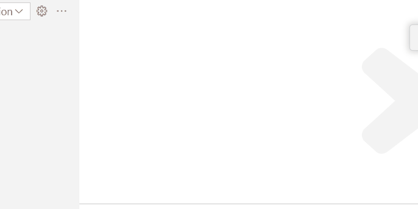

# Java Support

## JAX-RS code lens in a Renarde Application

---

When you are debugging a Renarde application,
vscode-quarkus provides a code lens above each method that declares a REST endpoint.
The code lens contains the URL of the REST endpoint.
For GET methods, if you click on the code lens, it will open the URL in your browser.
[Renarde `Controller` classes](https://quarkiverse.github.io/quarkiverse-docs/quarkus-renarde/dev/index.html#_controllers) use a different strategy than JAX-RS to determine which methods count as REST endpoints and what the URL of each endpoint is,
and vscode-quarkus takes this into account.

## JAX-RS workspace symbols in a Renarde Application

---

When you are working on a Renarde application,
vscode-quarkus provides workspace symbols for each method that declares a REST endpoint.
They start with `@`,
followed by the path of the URL,
then the HTTP method name.
In order to view all the workspace symbols,
you can use the keybinding `Ctrl+T`.
When you select a workspace symbol from the dropdown, it will take you to the Java code for the given method.
[Renarde `Controller` classes](https://quarkiverse.github.io/quarkiverse-docs/quarkus-renarde/dev/index.html#_controllers) use a different strategy than JAX-RS to determine which methods count as REST endpoints and what the URL of each endpoint is,
and vscode-quarkus takes this into account.
