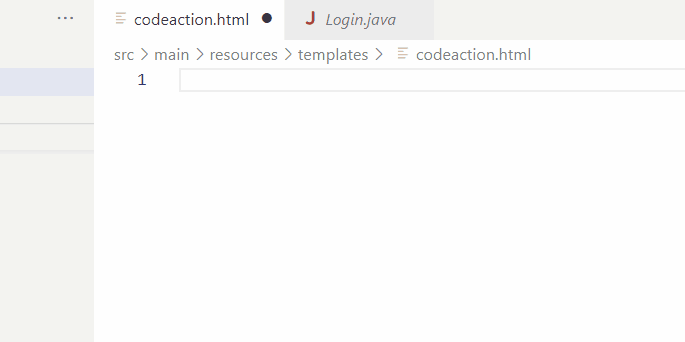
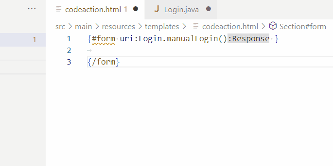

# Renarde Template support

Qute support provides `completions`, `validation`, `hover`, `definition` in Qute templates for:

 * [Renarde uri/uriabs namespace](https://quarkiverse.github.io/quarkiverse-docs/quarkus-renarde/dev/index.html#_obtaining_a_uri_in_qute_views). 
 * [User tags](https://quarkiverse.github.io/quarkiverse-docs/quarkus-renarde/dev/index.html#_user_tags) and [Renarde tags](https://quarkiverse.github.io/quarkiverse-docs/quarkus-renarde/dev/index.html#_renarde_tags).

## Renarde uri/uriabs namespace support

Qute support provides `completions`, `validation`, `hover`, `definition` for uri/uriabs namespace:

## User tags support

For [User tags](https://quarkiverse.github.io/quarkiverse-docs/quarkus-renarde/dev/index.html#_user_tags) please see [User Tags support](../qute/TemplateSupport.md#user-tags-support)

[Renarde tags](https://quarkiverse.github.io/quarkiverse-docs/quarkus-renarde/dev/index.html#_renarde_tags) are loaded from `templates/tags` of the Renarde dependency which means those tags depend on Renarde version. You can see Renarde `#form` tag in action in the previous demo.

### Quick fix

Form Tag in Renarde is validated and support with some quick fixes that will insert either the required inputs forms or all input forms as defined in the method.

